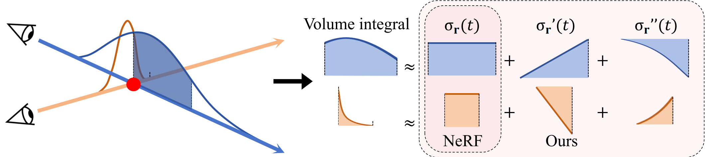
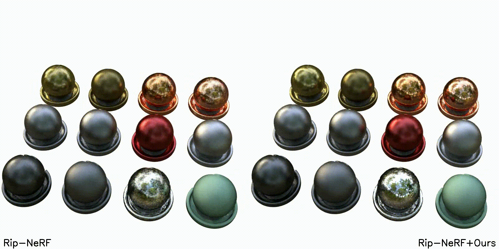
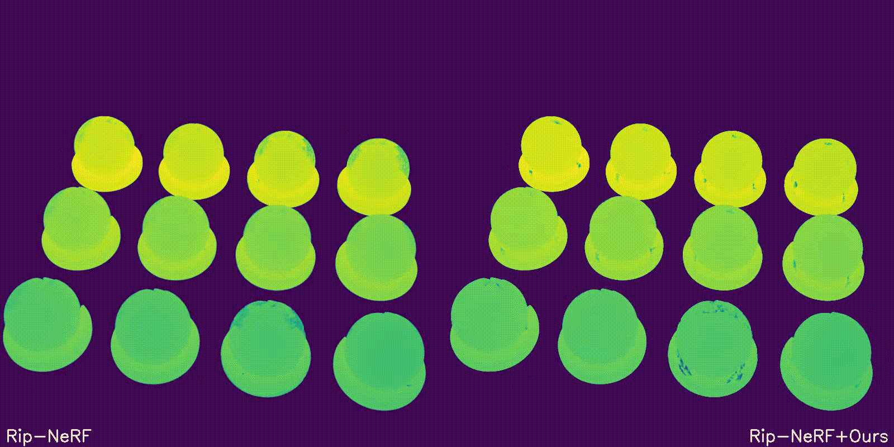

# Neural Rendering with Polynomial Volume Integral Representation
## Method Overview

Neural Radiance Fields (NeRFs) have gained popularity by demonstrating impressive capabilities in synthesizing realistic novel views from multiple view images. It approximates the continuous integration of rays as a finite Riemann sum of the estimated colors and densities of the sampled points. Although this allows for efficient rendering, approximating divergent integrals under varying directions and interval lengths with piecewise constant features does not account for high-order variations within integration intervals, leading to ambiguous representations and limited reconstruction quality. In this paper, we propose to model the distribution of the sampled intervals with Taylor series, which can encode the length and direction information of integrals to disambiguate interval distributions and mitigate integral approximation errors in volume rendering. We introduce a learnable gradient estimator and an adaptive interval length scaling module to capture smooth high-order spatial variations, enhancing optimization stability and performance. Our proposed method allows an easy integration with existing NeRF-based rendering frameworks. Experimental results on both synthetic and real-world scenes demonstrate that our method significantly boosts the rendering quality of various NeRF models, achieving state-of-the-art performance.

## Visual Blender Result
<p align="center">
  
  
</p>

## ⚙️ Setup
Our code is based on [Nerfacc](https://github.com/nerfstudio-project/nerfacc).
### Clone this repository.
```text
git clone --recursive https://github.com/taylor2nerf/taylor-nerf.git
```
### Install Environment via Anaconda (Recommended)
```text
conda create -n nerfacc python=3.10
conda activate nerfacc
pip install -r requirements.txt
```
### Compilation tiny-cuda-nn
```text
pip install git+https://github.com/NVlabs/tiny-cuda-nn/#subdirectory=bindings/torch
```
| Windows & Linux | cu113 | cu115 | cu116 | cu117 | cu118 |
|-----------------|-------|-------|-------|-------|-------|
| torch 1.11.0    | ✅    | ✅    |       |       |       |
| torch 1.12.0    | ✅    |       | ✅    |       |       |
| torch 1.13.0    |       |       | ✅    | ✅    |       |
| torch 2.0.0     |       |       |       | ✅    | ✅    |


### 📦 Dataset
We mainly test our method on NeRF Synthetic, and MipNeRF-360 v2 dataset. Put them under the data folder:
```text
data
└── nerf_synthetic
    └── hotdog
    └── lego
```

### 🏃 Training
We provide the script to test our code on each scene of NeRF Synthetic datasets. Just run:
```bash
bash scripts/train_ns_all.sh
```

